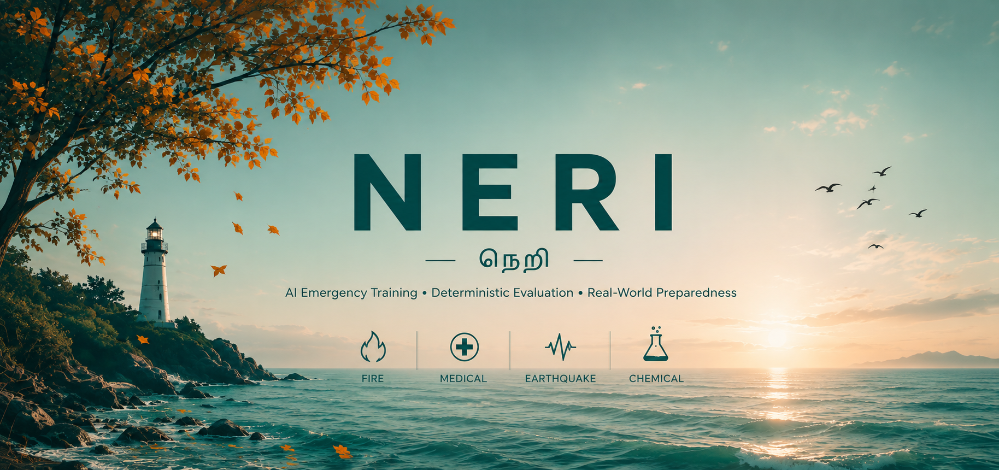

<p align="center">
  
</p>

<h1 align="center">NERI</h1>

<p align="center">
<b>நெறி</b>
</p>

<p align="center">
🍂 AI Emergency Training • 🌲 Deterministic Rules Engine • 🧠 Google Gemini • 🔥 Firebase
</p>

---

# 🌿 Why NERI?

**NERI (நெறி)** is a Tamil word meaning **path, principle, or code of conduct**.

The name reflects the project's core philosophy. While AI generates realistic emergency scenarios, a deterministic rules engine evaluates user decisions using established emergency-response guidelines instead of relying solely on AI-generated judgments.

The project was intentionally named **NERI** because its defining feature is guiding users according to structured emergency-response principles rather than treating AI as the final authority.

---

# ✨ Overview

NERI is a full-stack AI-powered emergency response training platform that helps users practice decision-making through realistic emergency simulations.

Rather than relying entirely on AI, NERI separates **scenario generation** from **decision evaluation**.

Google Gemini generates emergency scenarios, while a deterministic rules engine independently determines the correct response using trusted emergency-response guidance from organizations including FEMA, NFPA, OSHA, and the American Red Cross.

This architecture provides transparent, explainable, and consistent emergency-response training.

---

# 🌿 Features

- 🧠 AI-generated emergency scenarios powered by Google Gemini
- 🌲 Deterministic rules engine for transparent decision evaluation
- 🔍 Explainable scoring independent of AI judgments
- 🌍 Multiple emergency types
  - 🔥 Building Fire
  - 🌎 Earthquake
  - 🚑 Medical Emergency
  - ☣️ Chemical Spill
- 🍂 Phase-aware earthquake evaluation
- 📊 Firebase-powered progress tracking
- ☁️ Live deployment using Netlify and Railway
- 🧪 33 automated unit tests

---

# 🏗 Architecture

```text
                    NERI Architecture

             React + Vite Frontend
                      │
                      ▼
               Express Backend
                      │
      ┌───────────────┼───────────────┐
      ▼               ▼               ▼
 Google Gemini    Rules Engine     Firebase
 Scenario AI    Deterministic      Progress
                Evaluation         Storage
      │               │
      └───────► Training Results ◄───────┘
```

---

# 🧠 Deterministic Rules Engine

Most AI-powered training platforms rely entirely on a language model to both generate and evaluate responses.

NERI follows a different architecture.

- Google Gemini generates realistic emergency scenarios.
- Each response option contains a structured action code.
- A deterministic rules engine evaluates actions using emergency-response guidance.
- Earthquake scenarios support phase-aware evaluation (during shaking vs. after shaking).
- The backend determines the correct response before returning the scenario.

This separation ensures AI remains responsible for content generation while application logic remains responsible for scoring.

> **AI creates the scenario. The rules engine determines the correct response.**

---

# 📸 Screenshots

## Landing Page

> *(Add screenshot here)*

---

## Dashboard

> *(Add screenshot here)*

---

## Training Scenario

> *(Add screenshot here)*

---

## AI Coach & Results

> *(Add screenshot here)*

---

# 🛠 Tech Stack

### Frontend

- React
- Vite
- Tailwind CSS
- React Router

### Backend

- Node.js
- Express.js

### AI

- Google Gemini API

### Database

- Firebase Firestore

### Testing

- Vitest

### Deployment

- Netlify
- Railway

---

# 🚀 Running Locally

## Clone the repository

```bash
git clone https://github.com/YOUR_USERNAME/NERI.git
```

```bash
cd NERI
```

---

## Backend

```bash
cd backend
npm install
```

Create a `.env` file.

```env
GEMINI_API_KEY=YOUR_API_KEY
```

Run the backend.

```bash
npm start
```

---

## Frontend

```bash
cd frontend
npm install
npm run dev
```

---

# 🧪 Testing

Run all backend tests.

```bash
npm test
```

Current status:

- ✅ 33 automated unit tests passing
- ✅ Rules validation
- ✅ Deterministic scoring
- ✅ Emergency rule consistency

---

# 🍂 Future Improvements

- Additional emergency scenarios
- Adaptive difficulty based on user performance
- Multi-user collaborative training
- Instructor dashboard
- Scenario analytics and reporting
- Leaderboards and certification system
- Mobile-optimized training interface

---

# 👨‍💻 Author

Developed by **N Chandana**

Built to explore the combination of **AI-generated simulations** with **deterministic rule-based evaluation** for transparent emergency-response training.

---

# 📄 License.

Copyright © 2026 Your Name.

All rights reserved.

This project is provided for portfolio and demonstration purposes only.
Unauthorized copying, redistribution, or commercial use is prohibited.
