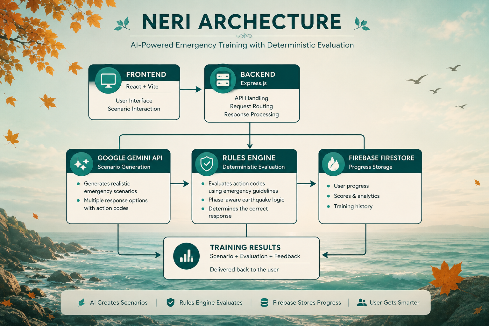
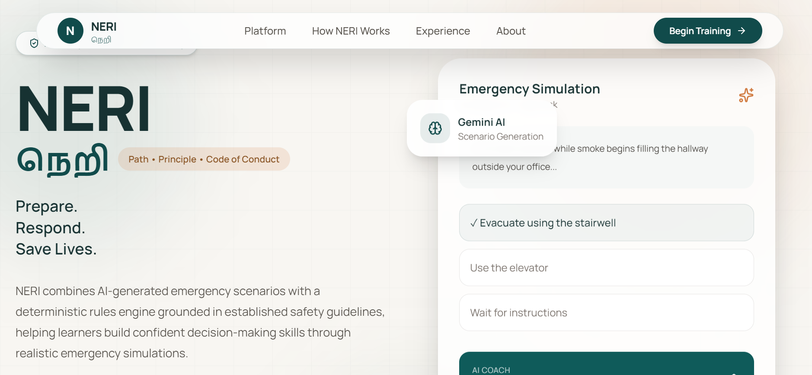
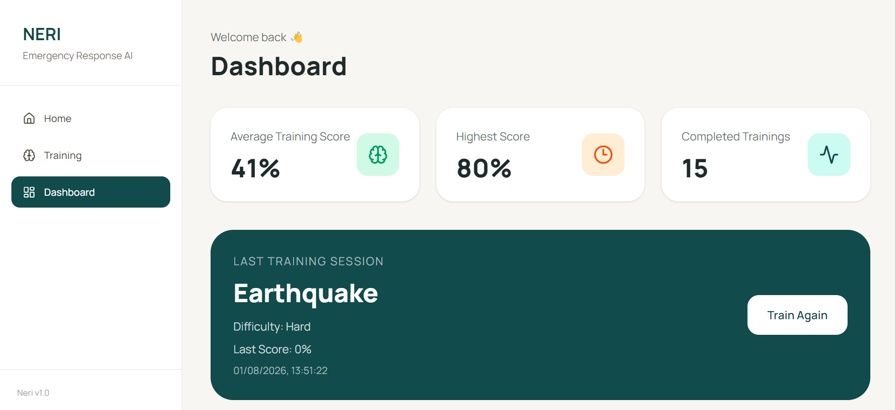
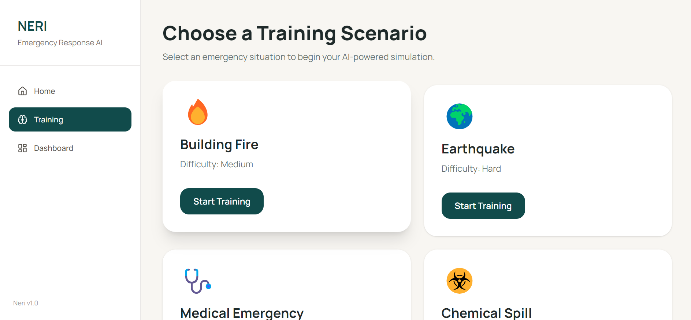
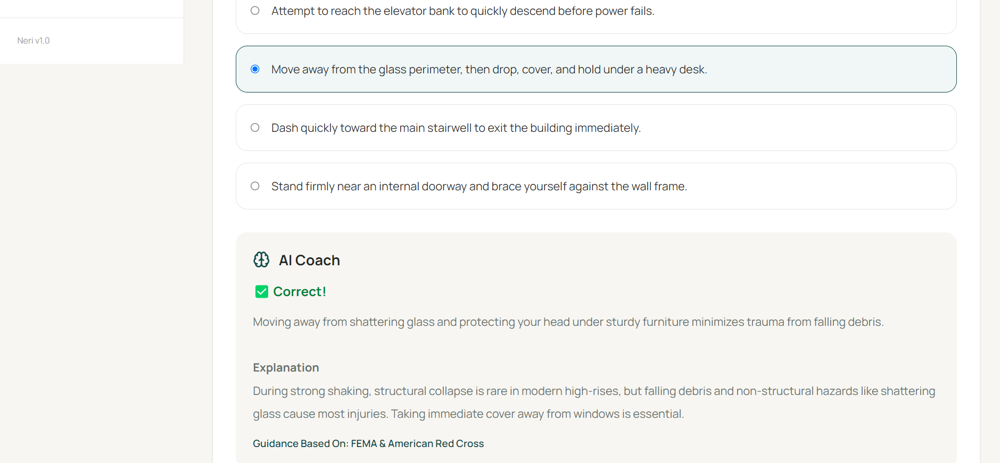
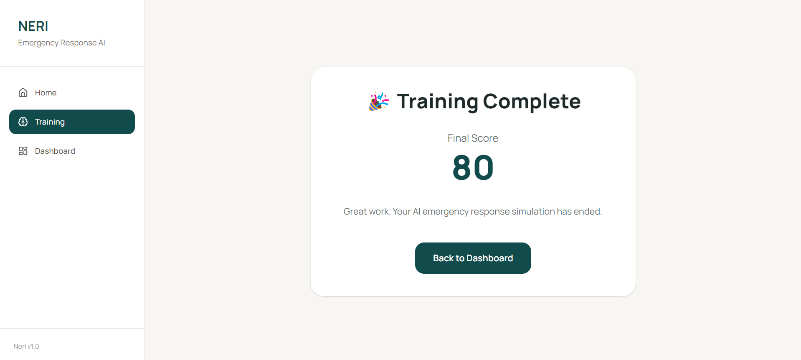

<p align="center">
  
</p>

<h1 align="center">NERI</h1>

<p align="center">
<b>நெறி</b>
</p>

<p align="center">
🍂 AI Emergency Training • 🌲 Deterministic Rules Engine • 🧠 Google Gemini • 🔥 Firebase
</p>

<p align="center">
🌐 <a href="https://neri-ai.netlify.app/">Live Application</a> •
📂 <a href="https://github.com/NChandana12/NERI">Source Code</a>
</p>


---

# 🌿 Why NERI?

**NERI (நெறி)** is a Tamil word meaning **path, principle, or code of conduct**.

The name reflects the project's philosophy: while AI generates emergency situations, every decision is evaluated against structured emergency-response principles rather than relying solely on AI judgment.

NERI demonstrates how **Generative AI and deterministic software engineering** can work together to create transparent, explainable, and trustworthy learning experiences.

---

# ✨ Overview

NERI is a full-stack AI-powered emergency response training platform that helps users develop life-saving decision-making skills through realistic emergency simulations.

Unlike conventional AI applications, NERI separates **content generation** from **decision evaluation**.

- **Google Gemini** generates dynamic emergency scenarios.
- **A deterministic rules engine** independently evaluates every response using trusted emergency-response guidance from organizations including FEMA, NFPA, OSHA, and the American Red Cross.

This architecture produces consistent, explainable, and transparent emergency-response training.

---

# 🌿 Features

- 🧠 AI-generated emergency scenarios using Google Gemini
- 🌲 Deterministic rules engine for transparent evaluation
- 🔍 Explainable AI Coach feedback
- 🌍 Multiple emergency simulations
  - 🔥 Building Fire
  - 🌎 Earthquake
  - 🚑 Medical Emergency
  - ☣️ Chemical Spill
- 🍂 Phase-aware earthquake evaluation
- 📊 Performance dashboard
- ☁️ Firebase Firestore data storage
- 🚀 Netlify + Railway deployment
- 🧪 Automated backend testing

---

# 🏗 Architecture

<p align="center">
  
</p>

---

# 🧠 Deterministic Rules Engine

Most AI-powered learning platforms allow the language model to both generate and evaluate answers.

NERI follows a different architecture.

- Google Gemini generates emergency scenarios.
- Each answer option contains a structured action code.
- A deterministic rules engine evaluates responses.
- Evaluation follows emergency-response best practices rather than AI opinions.
- Earthquake scenarios support phase-aware evaluation (during shaking vs. after shaking).

This separation ensures AI remains responsible for creativity while application logic remains responsible for correctness.

> **AI creates the scenario. The rules engine determines the correct response.**

---

# 📸 Screenshots

## 🏠 Landing Page

<p align="center">
  
</p>

---

## 📊 Dashboard

<p align="center">
  
</p>

---

## 🎯 Training Selection

<p align="center">
  
</p>

---

## 📝 Sample Training Question

<p align="center">
  
</p>

---

## 🧠 AI Coach Feedback

<p align="center">
  
</p>

---

## 🎉 Training Results

<p align="center">
  
</p>

---

# 🛠 Tech Stack

## Frontend

- React
- Vite
- Tailwind CSS
- React Router

## Backend

- Node.js
- Express.js

## Artificial Intelligence

- Google Gemini API

## Database

- Firebase Firestore

## Testing

- Vitest

## Deployment

- Netlify
- Railway

---

# 🚀 Running Locally

## Clone the repository

```bash
git clone https://github.com/NChandana12/NERI.git
```

```bash
cd NERI
```

---

## Backend

```bash
cd backend
npm install
```

Create a `.env` file.

```env
GEMINI_API_KEY=YOUR_API_KEY
```

Run the backend.

```bash
npm start
```

---

## Frontend

```bash
cd frontend
npm install
npm run dev
```

---

# 🧪 Testing

Run the backend test suite.

```bash
npm test
```

The project includes automated tests covering:

- ✅ Deterministic rules validation
- ✅ Emergency response scoring
- ✅ AI response parsing
- ✅ Rule consistency

---

# 🍂 Future Improvements

- Additional emergency scenarios
- Adaptive learning difficulty
- Instructor dashboard
- Team-based simulations
- Scenario analytics
- Certification system
- Fully responsive mobile interface

---

# 👨‍💻 Author

**N Chandana**

Built as a portfolio project exploring how **Generative AI** can be combined with **deterministic software systems** to create transparent emergency-response training.

---

# 📄 License

**Copyright © 2026 N Chandana**

All Rights Reserved.

This software and its source code are provided solely for portfolio, educational, and demonstration purposes.

You may **not**:

- Copy substantial portions of the source code
- Redistribute the project
- Modify and publish derivative works
- Use the project commercially without written permission

See the **LICENSE** file for complete terms.
